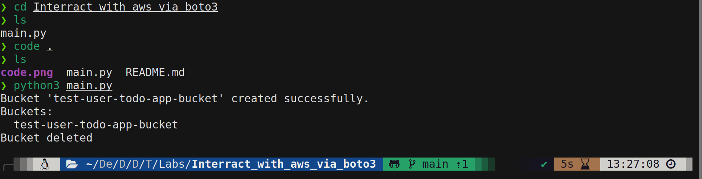
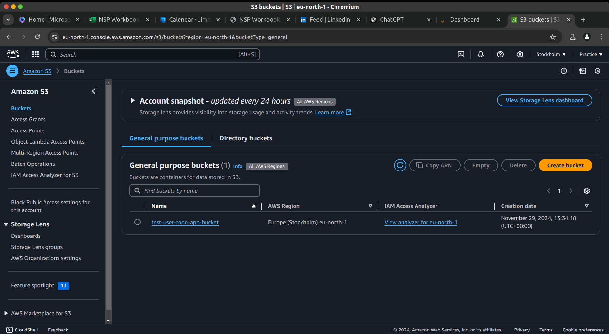

# AWS S3 Interaction with Python and Boto3

This lab demonstrates how to interact with AWS resources using a Python application and the **Boto3** library. The primary focus is creating, listing, and deleting an Amazon S3 bucket programmatically.

## Prerequisites

Before running the script, ensure the following:

1. **AWS Account**: You must have an AWS account.
2. **AWS IAM User**: The IAM user should have the necessary permissions for S3 (e.g., `AmazonS3FullAccess` or equivalent custom policy).
3. **Python Installed**: Install Python (3.6 or later).
4. **Boto3 Installed**: Install Boto3 by running:
   ```bash
   pip install boto3
   ```
5. **Environment Variables**: Set the following environment variables in your system:
   - `ACCESS_KEY_ID`: Your AWS access key ID.
   - `SECRET_ACCESS_KEY`: Your AWS secret access key.
   - `REGION`: Your preferred AWS region (e.g., `eu-north-1`).

## Features

The script includes the following functionality:

1. **Bucket Existence Check**:
   - Uses the `head_bucket` method to verify if the bucket already exists.
   - Prints a message if the bucket is found.
   - Attempts to create the bucket if it does not exist.

2. **Bucket Creation**:
   - Creates a bucket using `create_bucket` with region-specific configuration.

3. **Listing Buckets**:
   - Lists all S3 buckets in the AWS account using `list_buckets`.

4. **Deleting Buckets**:
   - Deletes a specified bucket using the `delete_bucket` method.

## How to Run the Script

1. Clone or download the repository to your local machine.
2. Navigate to the directory containing the script.
3. Set the required environment variables. For Linux/macOS:
   ```bash
   export ACCESS_KEY_ID=<your-access-key-id>
   export SECRET_ACCESS_KEY=<your-secret-access-key>
   export REGION=<aws-region>
   ```
   For Windows (Command Prompt):
   ```cmd
   set ACCESS_KEY_ID=<your-access-key-id>
   set SECRET_ACCESS_KEY=<your-secret-access-key>
   set REGION=<aws-region>
   ```
4. Run the script:
   ```bash
   python main.py
   ```

## Code Explanation

The script contains three main functions:

### `create_bucket(bucket_name)`
- Checks if the bucket exists.
- Creates the bucket with a specified region if it does not exist.

### `list_buckets()`
- Retrieves and prints a list of all buckets in the AWS account.

### `delete_bucket(bucket_name)`
- Deletes the specified bucket.

## Expected Output

The script will produce output similar to this:

```
Bucket 'test-user-todo-app-bucket' already exists.
Buckets:
  test-user-todo-app-bucket
  another-example-bucket
Bucket deleted
```

### Example: Command Execution
Below is a screenshot showing the script execution:



### Example: Bucket Created
Below is a screenshot showing the bucket created in the AWS S3 dashboard:



## Common Errors

- **`ClientError: Access Denied`**:
  - Ensure the IAM user has the appropriate S3 permissions.
- **`ClientError: InvalidAccessKeyId`**:
  - Verify that your AWS credentials are correct.
- **`S3UploadFailedError`**:
  - Ensure the bucket name and region comply with AWS naming and region constraints.

## Notes

- Bucket names must be globally unique across all AWS accounts.
- Ensure buckets are empty before attempting deletion to avoid `BucketNotEmpty` errors.
- Modify the `BUCKET_NAME` constant to test with different bucket names.
- You may want to comment out the `delete_bucket` function just so you can view the bucket in the AWS S3 dashboard.
